<p align="center">
  
</p>

<p align="center">
  <a href="https://stocksense-mcxw.onrender.com"></a>
</p>

<p align="center">
  
  
  
  
  
  
  
</p>

<p align="center">
  <a href="#try-it-live">Try it live</a> ·
  <a href="#features">Features</a> ·
  <a href="#how-stock-moves">How stock moves</a> ·
  <a href="#architecture">Architecture</a> ·
  <a href="#run-it-locally">Run it locally</a> ·
  <a href="backend/API.md">API reference</a> ·
  <a href="#team">Team</a>
</p>

**StockSense** replaces paper registers and Excel sheets with one web app for every stock movement:
receipts from vendors, delivery orders to customers, internal transfers between warehouses and racks,
and adjustments after a physical count. Every change is written to a stock ledger, so each quantity on
screen can be traced back to the moves that produced it.

Built for the **Odoo x LPU Jalandhar Hackathon 2026** (problem statement: *StockSense, Inventory Management System*).

<p align="center">
  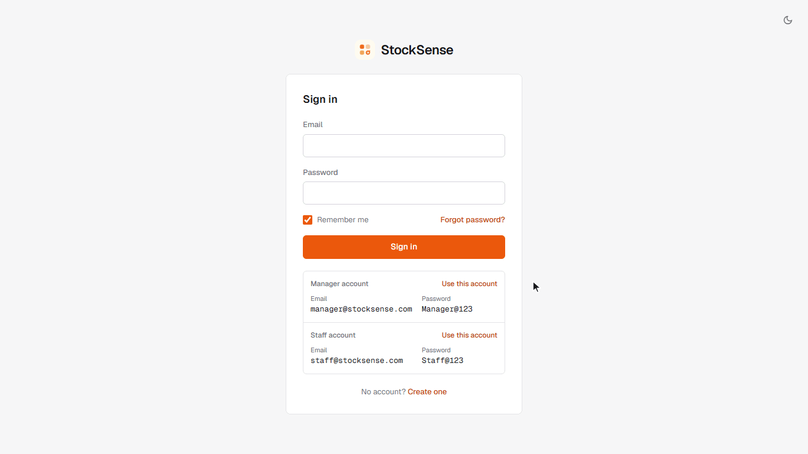
  <br>
  <sub>Sign in as the manager → receive 100 kg of steel rods → the stock ledger shows +100 → Ctrl + K search → night mode</sub>
</p>

## Try it live

**App: https://stocksense-mcxw.onrender.com**

| Role | Email | Password |
|---|---|---|
| Inventory Manager | `manager@stocksense.com` | `Manager@123` |
| Warehouse Staff | `staff@stocksense.com` | `Staff@123` |

Both accounts are listed on the sign-in screen: click **Use this account** to sign in with one click.

> [!NOTE]
> The app runs on Render's free plan, which sleeps after 15 minutes without visitors. The first visit after that
> takes about a minute while it wakes up; after that it is fast.

> [!TIP]
> **Forgot password works with the demo accounts too.** Their email addresses are not real inboxes, so the
> 6-digit code is shown on the screen. If you change a demo password, please set it back afterwards so the
> next person can sign in.

### A two-minute tour

1. Sign in as the **manager**. The dashboard shows the five KPIs from the problem statement; click a card to open the matching list, or filter by document type, status, warehouse, location and category.
2. **Receipts → New**: receive a product from a vendor and click **Validate**. The stock goes up at once.
3. **Delivery Orders**: open one that is **Waiting** (not enough stock). Receive the missing quantity and it turns **Ready** by itself, with the stock reserved for it. Then **Pick**, **Pack** and **Validate** to ship it.
4. **Move History → Stock ledger**: every move, with a running balance per product and location.
5. Click the **bell**: low-stock alerts with a **Reorder** button that opens a receipt filled with the suggested quantity.
6. Press **Ctrl + K** to search by SKU, product name or reference, and try the moon icon for night mode.
7. Sign out and sign in as **staff**: stock work is the same, but products, categories, reordering rules, warehouses and user roles are read-only.

### Live deployment

| | |
|---|---|
| App | https://stocksense-mcxw.onrender.com |
| Health check | https://stocksense-mcxw.onrender.com/api/health |
| Hosting | [Render](https://render.com) web service (free plan, Singapore). One service runs the API and serves the built frontend. |
| Database | [Neon](https://neon.tech) serverless PostgreSQL (Singapore, next to the app) |
| Deploys | Automatic on every push to `main`, configured in [render.yaml](render.yaml) |
| Demo data | Created on the first start; `npm run db:setup` only adds it to an empty database |

## Screenshots

<table>
  <tr>
    <td width="50%">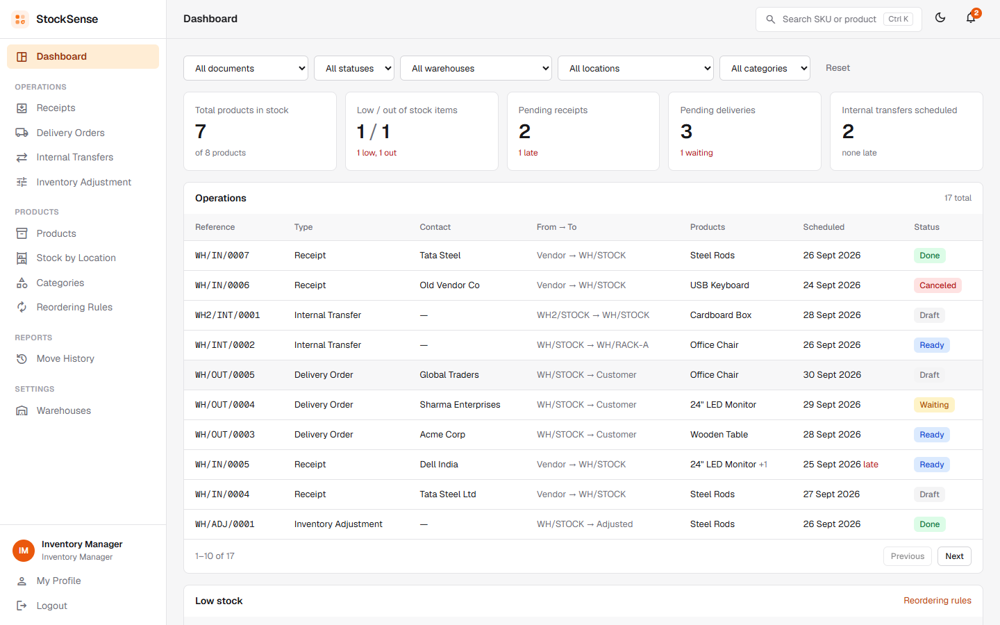<br><sub><b>Dashboard</b>: KPIs, filters and all operations</sub></td>
    <td width="50%">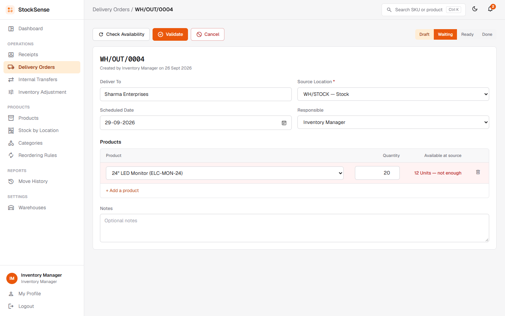<br><sub><b>Delivery order</b>: waiting, with stock availability per line</sub></td>
  </tr>
  <tr>
    <td width="50%">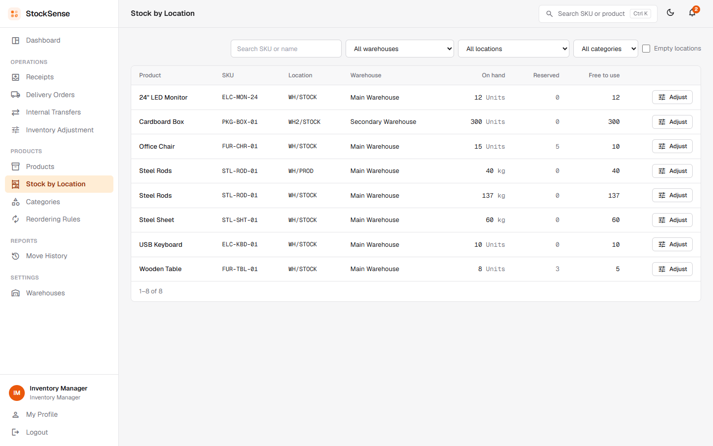<br><sub><b>Stock by location</b>: on hand, reserved and free to use</sub></td>
    <td width="50%">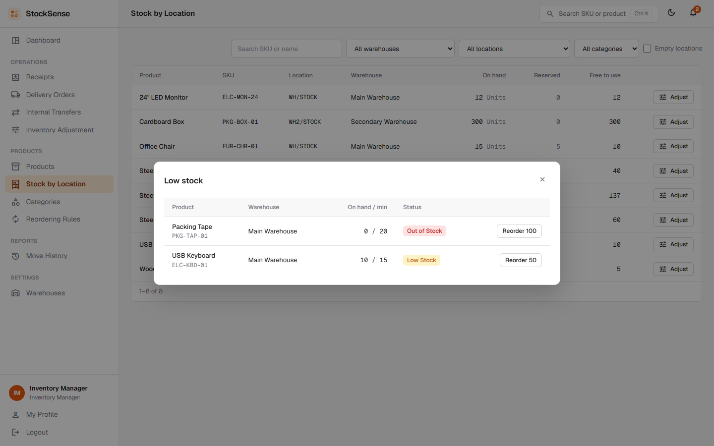<br><sub><b>Low-stock alerts</b>: one-click reorder</sub></td>
  </tr>
  <tr>
    <td width="50%">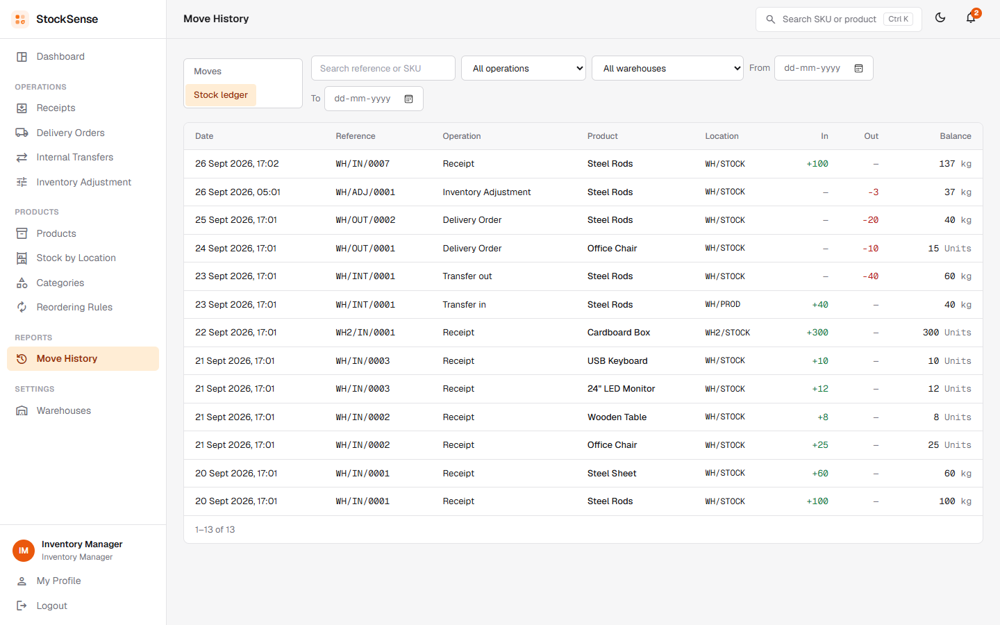<br><sub><b>Stock ledger</b>: running balance per location</sub></td>
    <td width="50%">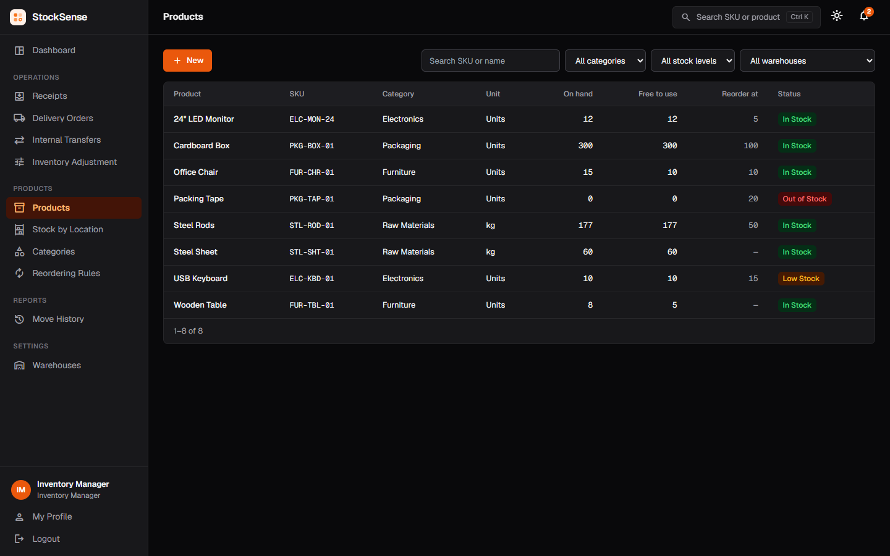<br><sub><b>Night mode</b>: every screen, one click</sub></td>
  </tr>
</table>

## Features

**Stock operations**
- **Receipts** (`WH/IN/0001`): goods arrive from a vendor; validating increases stock at the destination location.
- **Delivery orders** (`WH/OUT/0001`): pick → pack → validate; stock decreases at the source location.
- **Internal transfers** (`WH/INT/0001`): between locations or warehouses; total stock stays the same.
- **Inventory adjustments** (`WH/ADJ/0001`): enter the counted quantity (or a +/− difference); the difference is logged.
- **Reservation**: a delivery or transfer that is Ready reserves its stock. One that is Waiting becomes Ready by itself when stock arrives.
- References per warehouse and type, like Odoo (`WH/IN/0001`, `WH2/INT/0001`).

**Products and warehouses**
- Products with name, SKU, category, unit of measure, cost price and optional initial stock. Archiving keeps their history.
- **Stock by location**: on hand, reserved and free to use for every product in every location, with a quick **Adjust**.
- **Multi-warehouse**: each warehouse has its own locations (stock, racks, production floor).
- **Reordering rules** (min / max per warehouse) drive the low-stock and out-of-stock alerts.

**Dashboard and reports**
- KPIs: products in stock, low / out of stock, pending receipts, pending deliveries and scheduled internal transfers, with late and waiting counts.
- Filters by document type, status, warehouse, location and product category.
- **Move history** and a **stock ledger** with a running balance, filterable by date, type, warehouse and SKU.

**Accounts and everyday use**
- Sign up, sign in with "remember me", and **password reset with a one-time code (OTP)** sent by email.
- Two roles, **Inventory Manager** and **Warehouse Staff** (see [Roles](#roles)).
- **Ctrl + K** search, night mode, and a layout that works on phones.

## Roles

| | Inventory Manager | Warehouse Staff |
|---|---|---|
| Dashboard, stock by location, move history | Yes | Yes |
| Receipts, deliveries, transfers (create, validate, cancel) | Yes | Yes |
| Inventory adjustments | Yes | Yes |
| Products, categories, reordering rules | Create, edit, delete | View only |
| Warehouses and locations | Create, edit, archive | View only |
| User roles (Settings → Warehouses → Users and roles) | Change | Hidden |

The first account created on a new database becomes the manager, and later sign-ups join as staff. The server
enforces these rules as well (staff get `403 Forbidden`), not only the screens.

## Problem statement → app

| The problem statement asks for | Where it is in StockSense |
|---|---|
| Sign up / log in, OTP password reset, redirect to the dashboard | Sign-in screen → **Dashboard** |
| Dashboard KPIs: products in stock, low / out of stock, pending receipts, pending deliveries, internal transfers scheduled | **Dashboard**: five KPI cards, each opens the matching list |
| Dynamic filters: document type, status, warehouse / location, product category | **Dashboard** filter bar (updates the KPIs and the operations table) |
| Products: create / update, stock per location, categories, reordering rules | **Products**, **Stock by Location**, **Categories**, **Reordering Rules** |
| Product fields: name, SKU / code, category, unit of measure, initial stock | **Products → New** |
| Receipts: supplier and products → quantities → validate → stock increases | **Operations → Receipts** |
| Delivery orders: pick → pack → validate → stock decreases | **Operations → Delivery Orders** |
| Internal transfers (warehouse → production floor, rack → rack, warehouse → warehouse) | **Operations → Internal Transfers** |
| Stock adjustments: select product and location, enter the counted quantity | **Operations → Inventory Adjustment** |
| Move history / stock ledger | **Reports → Move History** (moves, and a ledger with a running balance) |
| Settings → Warehouse | **Settings → Warehouses** (warehouses and their locations) |
| Profile menu: My Profile, Logout | Bottom of the left sidebar |
| Bonus: low-stock alerts, multi-warehouse, SKU search and smart filters | Bell icon and dashboard, warehouses and locations, **Ctrl + K** search and list filters |

## How stock moves

The example from the problem statement, as the demo data stores it:

| Step | What happens | Ledger entry | Stock after |
|---|---|---|---|
| 1 | Receive 100 kg of steel from a vendor | `WH/IN` Vendor → WH/STOCK, +100 | WH/STOCK 100 |
| 2 | Move 40 kg to the production floor | `WH/INT` WH/STOCK → WH/PROD, 40 | WH/STOCK 60, WH/PROD 40 |
| 3 | Deliver 20 kg to a customer | `WH/OUT` WH/STOCK → Customer, −20 | WH/STOCK 40 |
| 4 | A count finds 3 kg damaged | `WH/ADJ` WH/STOCK → Adjustment, −3 | WH/STOCK 37 |

Every receipt, delivery and transfer goes through the same statuses:

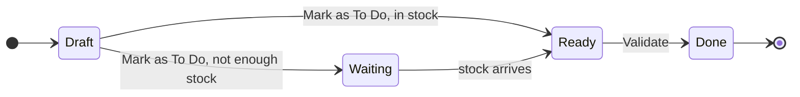

A Ready operation reserves its stock, and deliveries are picked and packed before they are validated. Draft, Waiting
and Ready operations can be canceled, and a draft can also be validated in one step.

Validating runs in one database transaction that locks the product rows (`SELECT … FOR UPDATE`) and only takes
stock that exists. Stock can never go below zero, even when two people validate at the same moment (a test checks this).

## Architecture

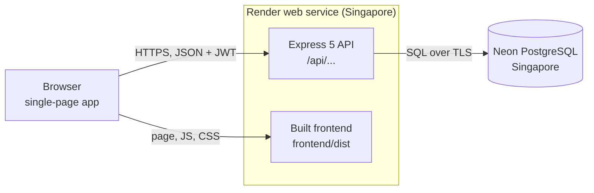

| Layer | Technology |
|---|---|
| Frontend | Vanilla JavaScript (ES modules, no framework), Vite 6, Tailwind CSS, hash router, light and night themes |
| Backend | Node.js 20+, Express 5, Zod 4 validation, JSON Web Tokens, bcrypt, Helmet, express-rate-limit, Nodemailer |
| Database | PostgreSQL with the `pg` driver: 12 tables, transactions with row locks |
| Hosting | Render (web service) and Neon (serverless PostgreSQL) |
| Tests | `node:test` end-to-end API tests against a real PostgreSQL database |

**Security**
- Passwords are hashed with bcrypt, and signing in with an unknown email takes as long as with a wrong password.
- Sessions use JWTs with a per-user token version, so logging out or changing the password signs you out on every device.
- Reset codes are stored only as HMAC-SHA256 hashes: valid 10 minutes, 5 wrong tries, 60 seconds between new codes.
- Rate limits on sign-in, sign-up and password reset; Helmet security headers with a strict Content Security Policy.
- Every request body and query is validated with Zod, and every SQL query is parameterized.

## Database

| Table | What it stores |
|---|---|
| `users`, `password_reset_otps` | accounts, roles and hashed, expiring reset codes |
| `warehouses`, `locations` | warehouses and their locations (stock, racks, production floor) |
| `categories`, `products` | the product catalog |
| `stock_quants` | the quantity of each product in each location (never negative) |
| `reorder_rules` | min / max stock per product per warehouse |
| `operations`, `operation_lines` | receipts, deliveries, transfers, adjustments and their products |
| `stock_moves` | the stock ledger: one row per product movement |
| `sequences` | counters for references like `WH/IN/0001` |

<details>
<summary><b>ER diagram</b></summary>

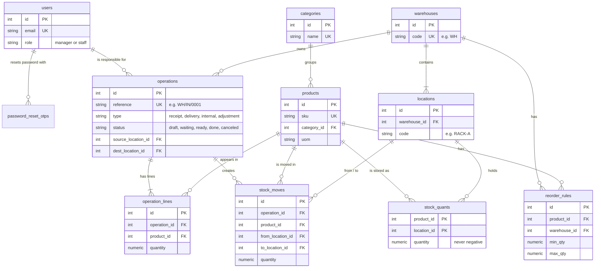

</details>

The app creates these tables itself (`npm run db:init`, from [backend/src/db/schema.sql](backend/src/db/schema.sql)).
The [Database/](Database) folder has the database team's standalone SQL scripts for the same tables: schema, a larger
seed (20 products) and reporting views, which can be loaded with `psql`.

## API

A REST API under `/api`. Every endpoint except sign-up, sign-in, the password reset steps and the health check needs
`Authorization: Bearer <token>`.

| Area | Endpoints |
|---|---|
| Auth | `POST /auth/signup`, `/auth/login`, `/auth/logout`, `/auth/forgot-password`, `/auth/verify-otp`, `/auth/reset-password`, `GET /auth/me` |
| Profile and users | `GET` / `PUT /users/me`, `PUT /users/me/password`, `GET /users`, `PATCH /users/:id/role` |
| Dashboard | `GET /dashboard`, `/dashboard/movement`, `/alerts/low-stock` |
| Products | `/products`, `/products/:id`, `/products/sku/:sku`, `/stock`, `/categories`, `/reorder-rules` |
| Operations | `/operations`, then `POST /operations/:id/confirm`, `check-availability`, `pick`, `pack`, `validate`, `cancel`; `/adjustments` |
| History | `GET /moves`, `/moves/ledger` |
| Settings | `/warehouses`, `/locations` |
| Health | `GET /health` |

Every endpoint, with its request, response and errors, is in **[backend/API.md](backend/API.md)**.

## Run it locally

Requirements: **Node.js 20+** and **PostgreSQL 13+** running locally.

```bash
# 1. Install backend and frontend packages
npm run setup

# 2. Configure the backend: copy the example file and put your PostgreSQL password in DATABASE_URL
cp backend/.env.example backend/.env        # Windows: copy backend\.env.example backend\.env

# 3. Create the database and tables, then load the demo data
npm run db:init
npm run db:seed

# 4. Start the backend (http://localhost:5000) and the frontend (http://localhost:3000) together
npm run dev
```

Open **http://localhost:3000**. The site runs only while `npm run dev` is running. Without an email server
(development), the reset code is shown on the screen and printed in the terminal.

| Command | What it does |
|---|---|
| `npm run setup` | Install backend and frontend packages |
| `npm run db:init` | Create the database (if missing) and the tables |
| `npm run db:seed` | Add the demo data (only into an empty database) |
| `npm run db:reset` | Drop and recreate all tables (deletes all data; refused in production) |
| `npm run dev` | Start backend and frontend with auto-reload |
| `npm run build` | Build the frontend into `frontend/dist` |
| `npm start` | Start the backend; with `NODE_ENV=production` it also serves `frontend/dist` |
| `npm test` | Run the API tests |

<details>
<summary><b>Environment variables</b> (<code>backend/.env</code>)</summary>

| Variable | Default | Purpose |
|---|---|---|
| `DATABASE_URL` | local `stocksense` database | PostgreSQL connection string (required in production) |
| `JWT_SECRET` | development-only value | Secret that signs login tokens (required in production) |
| `JWT_EXPIRES_IN` | `7d` | How long a sign-in lasts |
| `PORT` | `5000` | HTTP port |
| `CORS_ORIGIN` | `*` | Frontend origins allowed to call the API (comma separated) |
| `TRUST_PROXY` | `1` in production | Proxies in front of the app, so rate limits count each visitor |
| `OTP_EXPIRY_MINUTES` | `10` | How long a reset code is valid |
| `DEMO_EMAILS` | the two demo accounts | Accounts whose reset code is shown on screen instead of emailed |
| `SMTP_HOST`, `SMTP_PORT`, `SMTP_SECURE`, `SMTP_USER`, `SMTP_PASS`, `MAIL_FROM` | empty | Email server for reset codes (for example Gmail with an app password) |
| `TEST_DATABASE_URL` | none | Database for `npm test`; its name must contain `test` because it is wiped |

The frontend needs no settings for local development. [frontend/.env.example](frontend/.env.example) shows how to point it at
a backend on another address.

</details>

## Deploy your own

The backend serves the built frontend in production, so the whole app is **one web service**.

1. **Neon:** create a free project in the **Singapore** region (the region in [render.yaml](render.yaml)) and copy its connection string (`postgresql://...neon.tech/neondb?sslmode=require`).
2. **Render:** New → Blueprint → select this repository. When asked, paste the Neon string as `DATABASE_URL`. Render builds with `npm run setup && npm run build` and starts with `npm run db:setup && npm start`, which creates the tables and the demo data on the first start.
3. Open the `https://<name>.onrender.com` link. Every push to `main` redeploys automatically.

Reset emails: add `SMTP_HOST=smtp.gmail.com`, `SMTP_PORT=587`, `SMTP_USER` and `SMTP_PASS` (a Gmail app password) in
Render → Environment. Without them, codes for other accounts are only written to Render's logs; the two demo accounts
always show their code on the screen.

## Tests

```bash
# End-to-end API tests: set TEST_DATABASE_URL in backend/.env (a database whose name contains "test"), then
npm test
```

20 tests run against a real PostgreSQL database. They cover sign-up and roles, the reset code flow (including the
demo accounts), receipts, deliveries with reservation, two deliveries racing for the same stock, transfers,
adjustments, the stock ledger, and the dashboard KPIs and filters. [Tester.md](Tester.md) is the manual testing checklist.

## Project structure

```
.
├── backend/              Express API; in production it also serves the built frontend
│   ├── src/modules/      auth, users, warehouses, locations, categories, products,
│   │                     operations (stock engine), moves, dashboard
│   ├── src/db/           schema.sql, init (create / reset) and seed (demo data)
│   ├── tests/            end-to-end API tests
│   ├── API.md            API reference
│   └── README.md         backend details
├── frontend/             single-page app built with Vite
│   ├── index.html        layout and theme colors (light and night)
│   └── src/pages/        one file per screen
├── Database/             the database team's SQL scripts: schema, seed data, views
├── docs/images/          images used in this README
├── scripts/dev.mjs       runs backend and frontend together
├── render.yaml           Render Blueprint (deploys the app)
└── Tester.md             testing checklist
```

## Team

| Member | Role | GitHub |
|---|---|---|
| Yadav Anish | Backend, integration and deployment | [@YadavAnish56](https://github.com/YadavAnish56) |
| Bhupendra Sharma | Frontend | [@bhupendrasharmaX](https://github.com/bhupendrasharmaX) |
| Niraj | Database | [@Niraj-145](https://github.com/Niraj-145) |
| Jiya Raisinghani | Testing | |

<p align="center"><sub>Built for the Odoo x LPU Jalandhar Hackathon 2026</sub></p>
