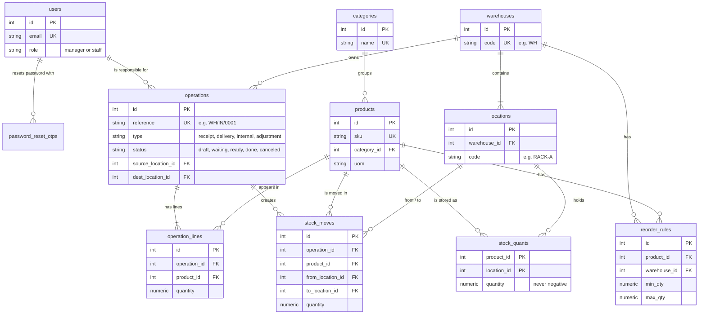

# StockSense Backend

REST API for **StockSense**, a modular Inventory Management System (Odoo x LPU Jalandhar Hackathon 2026).

**Stack:** Node.js (Express 5) · PostgreSQL · JWT auth · Zod validation

All endpoints are documented in **[API.md](API.md)**. The web app lives in [`../frontend`](../frontend);
see the [root README](../README.md) to run both together with `npm run dev`.

## Features

- Sign up / login with JWT, logout, OTP-based password reset (email, or console in development)
- Manager and staff roles
- Products with SKU, category, unit of measure, cost, optional initial stock, archiving
- Multi-warehouse: warehouses → locations (racks, production floor, ...), stock per location
- Receipts, delivery orders (pick → pack → validate), internal transfers:
  draft → waiting / ready → done / canceled, with Odoo-style references (`WH/IN/0001`)
- Stock reservation: ready deliveries reserve stock; waiting ones become ready automatically when stock arrives
- Stock adjustments by counted quantity or +/− difference
- Stock ledger (move history) for every stock change
- Reordering rules per warehouse, low stock / out of stock alerts
- Dashboard KPIs with warehouse / category filters; list filters by type, status, warehouse,
  location, category, product, date and SKU / name search

## Setup

Requirements: Node.js 20+ and PostgreSQL 13+.

```bash
cd backend
npm install
cp .env.example .env        # then set DATABASE_URL (your postgres password) and JWT_SECRET
npm run db:init             # creates the database + tables
npm run db:seed             # optional: demo data
npm run dev                 # starts http://localhost:5000 and restarts on file changes
```

Demo accounts (after `db:seed`):

| Role | Email | Password |
|---|---|---|
| Manager | manager@stocksense.com | Manager@123 |
| Staff | staff@stocksense.com | Staff@123 |

## Scripts

| Command | What it does |
|---|---|
| `npm run dev` | Start with auto-restart |
| `npm start` | Start |
| `npm run db:init` | Create the database and any missing tables (safe to re-run) |
| `npm run db:reset` | **Delete all data** and recreate the tables |
| `npm run db:seed` | Add demo data (only into an empty database) |
| `npm test` | End-to-end API tests; needs `TEST_DATABASE_URL` (a separate database that gets wiped) |

## Project structure

```
src/
  server.js              start the HTTP server
  app.js                 Express app: middleware + routes
  config.js              settings from .env
  db/
    schema.sql           all tables (PostgreSQL)
    init.js              create / reset the database
    seed.js              demo data
    pool.js              connection pool + transaction helper
  middleware/            auth (JWT, roles), zod validation, error handler
  modules/
    auth/                signup, login, logout, OTP reset
    users/               profile, change password, roles
    warehouses/          warehouses (settings)
    locations/           locations inside warehouses
    categories/          product categories
    products/            products, stock per location, reordering rules
    operations/          receipts, deliveries, transfers, adjustments + stock engine
    moves/               stock ledger / move history
    dashboard/           KPIs and low stock alerts
  utils/                 errors, validators, mailer, helpers
tests/api.test.js        end-to-end tests
```

## Database design

| Table | Purpose |
|---|---|
| `users`, `password_reset_otps` | accounts and hashed, expiring OTPs |
| `warehouses`, `locations` | multi-warehouse structure |
| `categories`, `products` | product catalog |
| `stock_quants` | current quantity of each product in each location (never negative) |
| `reorder_rules` | min / max stock per product per warehouse |
| `operations`, `operation_lines` | receipts, deliveries, transfers, adjustments and their products |
| `stock_moves` | the stock ledger: one row per product movement |
| `sequences` | counters for references like `WH/IN/0001` |

Stock changes run inside database transactions with row locks, so two people validating at the same time
can never push stock below zero (covered by a test).

### ER diagram



How the example from the problem statement is stored:

| Step | `operations` | `stock_moves` (ledger) | `stock_quants` after |
|---|---|---|---|
| Receive 100 kg steel | `WH/IN/0001` receipt, done | Vendor → WH/STOCK, 100 | WH/STOCK 100 |
| Move to production rack | `WH/INT/0001` internal, done | WH/STOCK → WH/PROD, 40 | WH/STOCK 60, WH/PROD 40 |
| Deliver 20 | `WH/OUT/0002` delivery, done | WH/STOCK → Customer, 20 | WH/STOCK 40 |
| 3 kg damaged | `WH/ADJ/0001` adjustment, done | WH/STOCK → Adjustment, 3 | WH/STOCK 37 |
